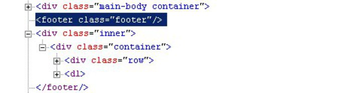
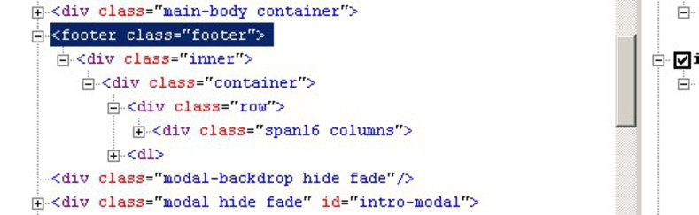
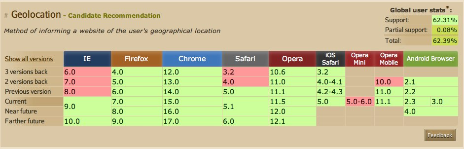

!SLIDE center
## Polyfills:
# SHIMS AND SHIVS
By Josh Dzielak

halloween 2011

!SLIDE bullets incremental
# About Me:
* Founding Developer at 
* We're a Safe Social Network for Kids
* We joined Disney in 2011

!SLIDE bullets incremental
# My shivs of choice
* JavaScript
* Ruby
* Node, Sinatra, Rails

!SLIDE bullets incremental
sometimes
# I think about
* JavaScript module organization/AMD
* Design patterns
* App Platforms

!SLIDE bullets incremental
today let's talk about
# POLYFILLS
"A shim that mimics a future API providing fallback functionality to older browsers." - Remy Sharp

Polyfills help you use technologies available in new browsers while supporting old ones.

!SLIDE center bullets incremental
# Why is this good?
* Polyfills speed adoption, like w/ HTML5.
* B/c they let developers do the new stuff...
* with less work to support the old stuff too

!SLIDE center bullets incremental
spooky
# Example
* ## Using HTML5 tags in an 'older' browser...
      @@@ html
      <footer>...</footer>

!SLIDE center bullets incremental
.notes 'use horrible'

...like

# Internet

# "Expect Horror"

# 8

* srry ie kthx

!SLIDE center
### HTML5 Tag support:

### With [html5shim.js](http://code.google.com/p/html5shim/)

!SLIDE center
## Don't worry. There's more.
But first,
# Let's settle
# an old score...

!SLIDE bullets incremental
.smalls Is it
# "Shims" OR "Shivs" ?
* ## Yes!

!SLIDE bullets incremental
## Shims are tools.
* ## Shivs are weapons.
* ## And \(tools + weapons\) =

!SLIDE center
# MACGYVER

!SLIDE center bullets incremental
## If
* ## MACGYVER

!SLIDE center

!SLIDE center bullets incremental
# MACGYVER
* ## OK

!SLIDE center bullets incremental
## uses shims as shivs
* ## (to keep the of peace)
* # THAN SO CAN YOU!

!SLIDE center bullets incremental
# I've heard of it!
* ## Cool.
* So, for your next project, ask:
* Who am I supporting?
* What modern feature do I need?

!SLIDE center incremental
Maybe you want geolocation

for some desktop and mobile browsers.

## What now?
Sure,
# LMGTFY

!SLIDE commandline incremental

	$ google 'new guy needs polyfill'
	processing........
	processing........
	processing........
	processing........
	processing........
	processing........

!SLIDE center
### Results Found!

### http://caniuse.com/
## Verdict:
Need polyfill for earlier Safari, IE, and Opera.

!SLIDE center bullets incremental
detect features, not browsers
# Modernizr
* Know when to shim.
* Bundled /w Yepnope, a conditional script loader.
* It's EASY enough to show you an example using BIG fonts.

!SLIDE incremental
      @@@ javascript
      Modernizr.load({
        test: Modernizr.geolocation,
        yep : 'geo.js',
        nope: 'geo-polyfill.js'
      });
# Proved it!

!SLIDE center incremental bullets
# Bonus Round
* Yepnope can help you handle all sorts of yes/no things.
* Like your development environment.

!SLIDE incremental
      @@@ javascript
      Modernizr.load({
        test: Environment.dev,
        yep : 'facebook.mocks.js',
        nope: 'facebook.all.js'
      });
# Slam Dunk!

!SLIDE center bullets incremental
# Things Commonly Polyfilled
## Let's explore a few.

!SLIDE center bullets incremental
## HTML5 Audio
* [jPlayer](http://github.com/happyworm/jPlayer) -  jQuery, Flash Fallback
* [audio.js](http://kolber.github.com/audiojs) - Drop-In, Flash Fallback
* ## HTML5 Video
* [video for everybody](http://web.archive.org/web/20101205155004/http://camendesign.com/code/video_for_everybody) - Markup, no JS. Nice!

!SLIDE center bullets incremental
## CSS3
* [css3-mediaqueries-js](http://code.google.com/p/css3-mediaqueries-js/)- Media Queries Everywhere
* [cssFx](http://imsky.github.com/cssFx/) - Inserts Vendor-Specific Properties
* [Scoped CSS](https://github.com/thingsinjars/jQuery-Scoped-CSS-plugin) - Limit Styles!

!SLIDE center bullets incremental
## Web Sockets
* [sockjs](https://github.com/sockjs/sockjs-client) - Full solution for WebSocket emulation
* [socket io](http://socket.io/) - Client+Server
* [pusherapp](http://pusherapp.com/) - WaaS

!SLIDE center bullets incremental
# Choosing Polyfills
* Documentation/Readable Source
* Community support & activity
* License
* File Size

!SLIDE center bullets
Now, some general
## DO's
and
# DON'TS
at least one

!SLIDE center bullets
Don't be
# AFRAID
to try new technologies...

!SLIDE center bullets incremental
##...just because you have to support legacy platforms.
# YOUR'E NOT ALONE

!SLIDE center bullets incremental
DO use

# these

# philosophies

## to help you

structure the problem

!SLIDE center bullets incremental
you might know about
# Progressive

# Enhancement

"Progressive enhancement is a strategy for web design that emphasizes accessibility, semantic HTML markup, and external stylesheet and scripting technologies."
\- [From  wikipedia](http://en.wikipedia.org/wiki/Progressive_enhancement)

!SLIDE center bullets incremental
but what about
# Regressive

#Enhancement

"The “polyfill” or “regressive enhancement” technique just means that you go ahead and use the new features, then use JavaScript to emulate native behavior in older browsers."
\- [From Alex Sexton](http://www.sitepoint.com/regressive-enhancement-with-modernizr-and-yepnope/)

!SLIDE center bullets incremental
# Recap
* ## So that's

!SLIDE center bullets incremental
* ## Progressive Enhancement
  * design and build something that works everywhere (to the baseline)
  * extend to new capabilities where you can
* ## Regressive Enhancement
  * design and build with the latest and greatest
  * backfill where it breaks

!SLIDE center bullets incremental
# Meanwhile in Reality

## Both philosophies are useful.

There are myriad considerations.

What's important to you?

## Use your <em>Best Judgment</em>®.

You'll be fine!

!SLIDE center bullets incremental
what's that?
## you're using a shim now?
# High Five
## But what if you need to make a shim?

!SLIDE center bullets incremental
# A few guidelines
* Don't shimitate. Does it exist already?
* Strive for API Compatibility
* Be supertiny
* Read [Addy's Guide](http://addyosmani.com)

!SLIDE center bullets incremental
# Thanks!
* I hope you have a better idea of
* ## what polyfills are
and more importantly
* ## how to think about them

!SLIDE center bullets
# Further Reading
* [What is a polyfill?](http://remysharp.com/2010/10/08/what-is-a-polyfill/)
* [HTML5 Cross-Browser Polyfills](https://github.com/Modernizr/Modernizr/wiki/HTML5-Cross-Browser-Polyfills)
* [Quirksmode Compatibility](http://www.quirksmode.org/compatibility.html)
* [Mozilla Developer Network](https://developer.mozilla.org/en-US/)
* [History of the HTML5 Shiv](http://paulirish.com/2011/the-history-of-the-html5-shiv/)

!SLIDE center bullets
# HAPPY HALLOWEEN!

# QUESTIONS?
